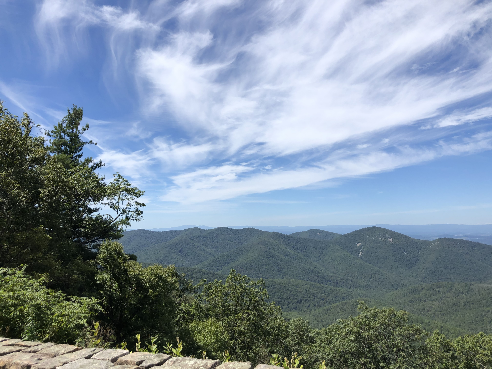
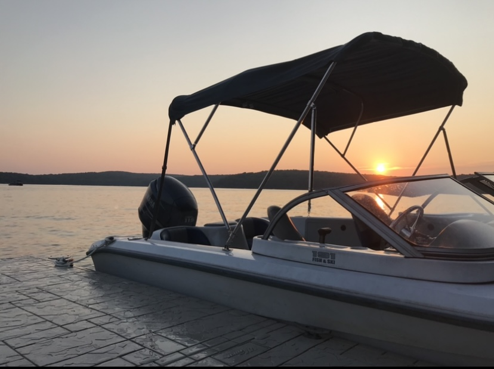
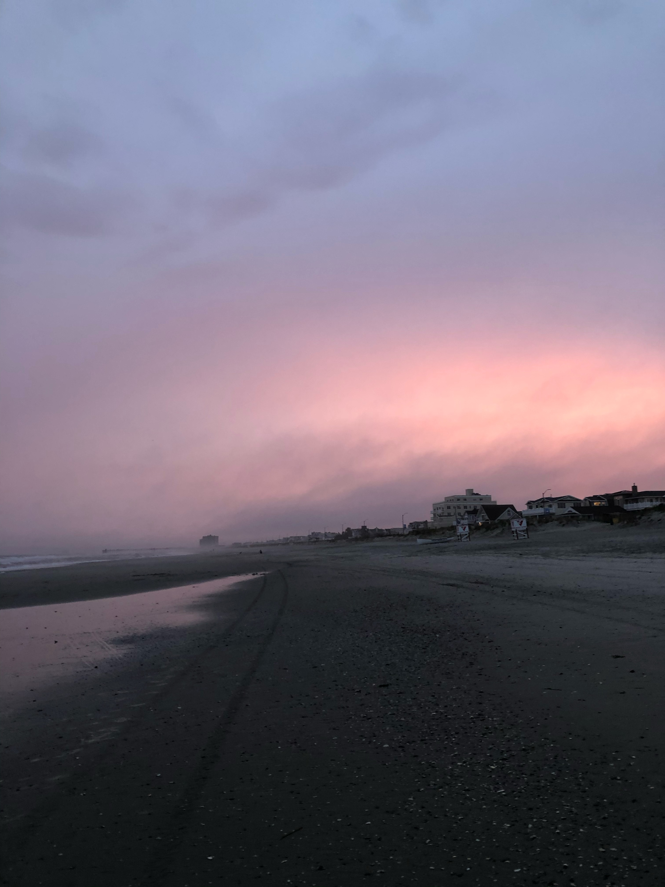
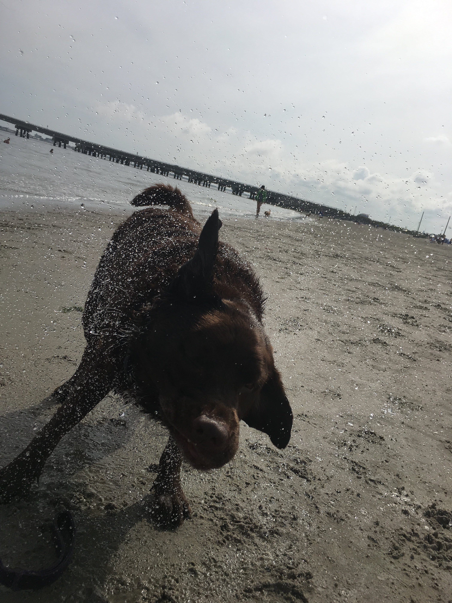

## Elise Fiannaca

Hi my name is Elise Fiannaca and I am a sophomore management major with Honors and CIS minors. I am on the varsity lacrosse team and play defense. 

This is a website I have created that scratches the surface about who I am. I am very thankful for all the oppurtunities I have recieved in my life, and will continue to take full advantage of them. 

# Hobbies

I enjoy surfing the Jersey shore in the summer, and I love skiing in the winter. My favorite place I have skiied is Deer Valley in Utah. I also journal to articulate my thoughts clearly and read books about how I can maximize my day. God is also a very important part of my life. I love watching the sun rise and set because I am fascinated by all of the diverse colors in the sky. Lastly, I love going on walks/ hikes to embrace and fully appreciate nature.

## Family

I have a twin sister named Brooke attending the University of Rochester, an older brother named Lenny attending Tufts University, a younger brother named Frank who is a freshman in high school, and two parents named Mary and Frank who run their own payroll company. My dog, Simba, is a chocolate lab who has nothing but love to give. 

### Pictures

 width="200"  width="200"

